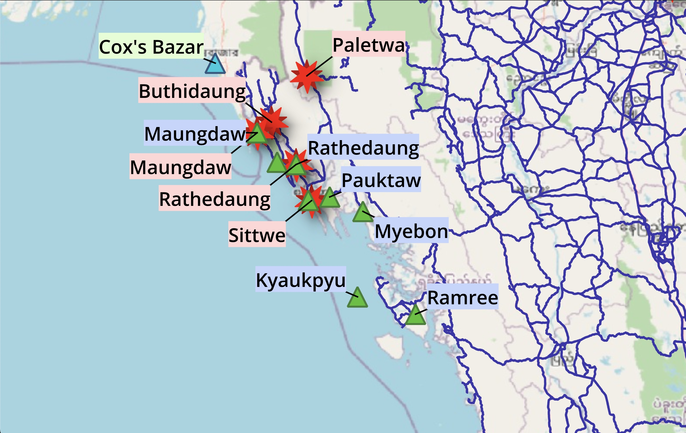

# Rohingya Flee Project

## Overview
This project analyzes and visualizes data related to the Rohingya refugee crisis. It aims to provide insights into the patterns, challenges, and outcomes of the displacement.

## Project Structure
- **results/** contains data files generated by Flee3 and FabFlee simulation softwares.
- **scripts/** includes scripts for data processing, analysis, and visualization.
- **plots/** stores the outputs of the analysis, including charts, graphs, and reports.

## Results
The data files created as a result of the analysis are available in the `plots/data/` folder. The plots generated from this data and from the `results/` folder can be found in the `plots/png/` folder.

## How to Use
1. Configure and run desired simulation scenarios using Flee3 and FabFlee. Edit the job file (`run_multiple_simulation.sh`) as needed and get multiple runs of the chosen conflict scenarios.
2. Navigate to this project directory, and copy over all folder generated in `FabSim3/results/` to the `results/` folder.
3. Run the scripts in the `scripts/` folder to reproduce the analysis, or add your own scripts here.

## Requirements
- Python 3.x
- Required libraries (see `requirements.txt`). These also include libraries required to run Flee3 and FabFlee.

## License
This project is licensed under the MIT License. See the `LICENSE` file for details.